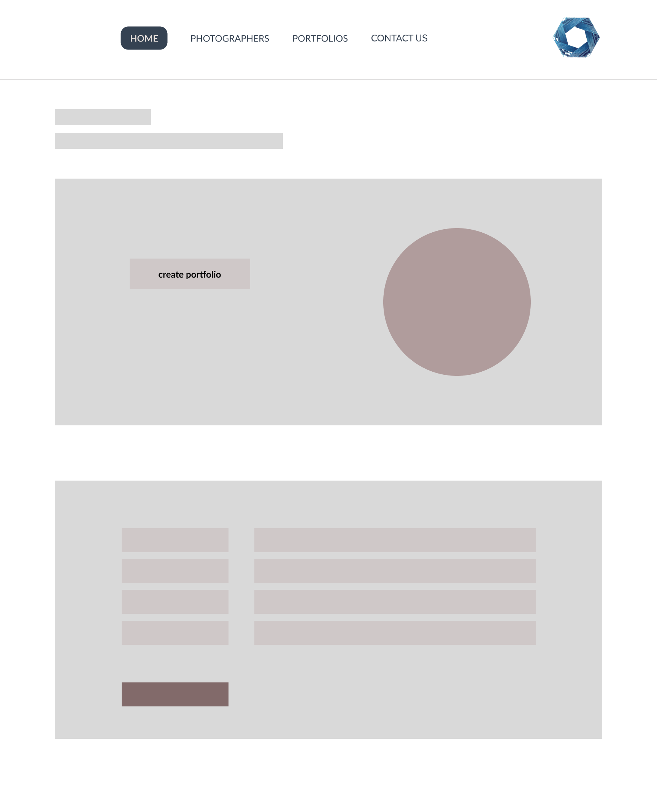
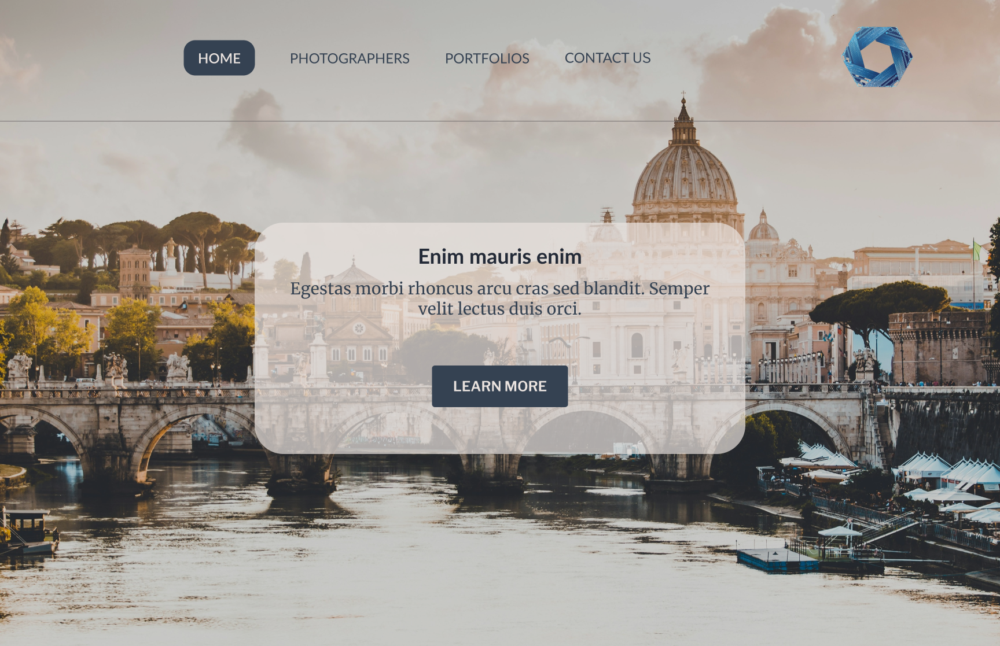

# Project Title
PhotoNest
Photographer Portfolio Showcase Website

## Overview
<!-- Single sentence like a pitch.-->
The website allows a photographer to create a profile and showcase their work through portfolios. It serves as a platform for a photographer to display their skills and for potential clients to browse and connect with them.

### Problem

Photographers need a user-friendly and visually appealing platform to showcase their work online. Existing platforms often lack the simplicity or are too complex for users to navigate and maintain. This can make it difficult for photographers to effectively present their portfolios and attract potential clients. The challenge is to develop a website that combines ease of use and aesthetic appeal to meet the needs of photographers.

### User Profile
<!-- What problems are we solving for them  -->

2 Types of Users:
* Photographer: Users of the website will primarily be a photographer looking to showcase their work. 
    * One portfolio page per photographer, that is accessible through their a link from either the navigation bar or their names in the photographer's page. 
    * Showcase their work through the platform by uploading images.
    * The app must provide an intuitive interface for a photographer to upload and organize their photos.
    * Communicate with potential clients through the contact form.
    * Engage in social interactions through comments and likes.

* Client: Potential clients seeking to hire a photographer.
    * Browse through different portfolios
    * A seamless browsing experience for visitors.
    * Possibly engage in social interactions through comments and likes
    * Communicate with the photographers through a contact form

### Features
<!-- Put yourself as the user of your app and then what problems would you like to be solved. Describe it as much as possible-->
* Register and Login: 
    - Pages for user authentication.
* Photographer Profile(Dashboard): 
    - Photographer can create and manage personal profile.
* Portfolio Creation: 
    - Photographer can upload and organize their photos into portfolios. 
    - Only users registered as "photographers" can create and edit portfolios. 
    - Users who are registered as "clients" will be redirected to the not found page when they click on the edit portfolio navigation. 
* Portfolio Viewing: 
    - Visitors can browse portfolios by photographer. 
    - Only registered users can browse portfolio of registered photographers. 
    - Guests who did not register could only view the landing page and the contact page. 
* Contact Form: 
    - Potential clients can contact a photographer directly through a form.
* Responsive Design: 
    - The website will be fully responsive to ensure a good user experience on all devices.

## Implementation

### Tech Stack
<!-- List technologies that will be used in your app, including any libraries to save time or provide more functionality. Be sure to research any potential limitations. -->

Frontend
HTML
CSS
JavaScript
React.js

Backend
Node.js
Express.js

Database
MySQL with Knex.js for query building

Client Libraries
react
react-router-dom
react-modal
axios
sass
mui/icons-material
mui/material

Server libraries
express

External Libraries (Store and serve user-generated content like images)
Cloudinary

Limitations:
Cloudinary: Limitations in terms of storage space, API call limits, or bandwidth.

### APIs

Cloudinary API: For image upload and management

### Sitemap
<!-- List the pages of your app with brief descriptions. You can show this visually, or write it out. -->

1. Home Page: Overview of the website and features a photographer.
2. Photographer Profile: Individual profile page for a photographer. This will be a gallery if there is more than one photographer and it will link to their individual profile.
3. Portfolio Section: Display of portfolios and individual photo galleries.
4. Contact Form: Form for visitors to contact a photographer.

### Mockups
<!-- Provide visuals of your app's screens. You can use tools like Figma or pictures of hand-drawn sketches. -->
HOME PAGE
DASHBOARD PAGE

HOME PAGE

PHOTOGRAPHER PAGE

PORTFOLIO SECTION

CONTACT PAGE

### Data
<!-- Describe your data and the relationships between them. You can show this visually using diagrams, or write it out.  -->
<!-- drawSQL to visualize relationships -->

### Endpoints
<!-- In the final readMe can include the endpoint, short description, parameters, and response body -->
* GET /api/portfolio/:id: Retrieve a specific portfolio.

* POST /api/upload: Upload an image.

* GET/api/hero:
* GET /api/herp/:user_id:
* POST /api/herp/upload:

* GET /api/work:
* GET /api/work/:user_id:
* POST /api/work/upload:

* GET /api/about/:
* GET /api/about/:user_id:
* POST /api/about/upload:

* GET /api/connect:
* GET /api/connect/:user_id:
* POST /api/connect/upload:

* GET /api/gallery:
* GET /api/gallery/:user_id:
* POST /api/gallery/upload:

* POST /api/contact: Send a message to a photographer.

### Auth
* POST /api/auth/register: User registration.
* POST /api/auth/login: User login.
* GET /api/auth/profile: Retrieve user token.
* GET /api/auth/logout: User logout.

## Roadmap
<!-- Scope your project as a sprint. Break down the tasks that will need to be completed and map out timeframes for implementation. Think about what you can reasonably complete before the due date. The more detail you provide, the easier it will be to build. 
This could be in Jira -->

Week 1: Planning and Backend Development
* Set up database schema and APIs for user registration, portfolio creation, and image management.
* Implement backend logic for handling image uploads using Microsoft Azure and Onedrive API.
* Begin frontend development for photgrapher profile and portfolio creation.
* Begin frontend development for contact form.
* Implement user authentication and profile management.

Week 2: Frontend Development and Integration

* Complete frontend development for portfolio creation and display.
* Integrate frontend with backend APIs.
* Test and refine portfolio creation and image upload functionality.
* Test and refine the contact form functionality.
* Ensure responsive design and test on multiple devices.

## Nice-to-haves
<!-- Your project will be marked based on what you committed to in the above document. Under nice-to-haves, you can list any additional features you may complete if you have extra time, or after finishing. -->

Features:
* Search Functionality: Visitors can search for a photographer by name, location, or specialty.
* Advanced Search Filters: Allow visitors to filter a photographer by various criteria such as price range, location, and style.
* Booking System: Enable clients to book sessions with a photographer directly through the website.
* Blog Section: Allow a photographer to post articles or updates.
* Comment and Like System: Users can leave comments and likes on photos or portfolios.
* Social Media Integration: Photographers can link their social media profiles.

Sitemap:
* Search Results: Page to display search results based on user queries.
* Booking System: Page to where clients can book sessions with a photographer.
* Blog Section: Page where a photographer could create and posts blogs.

Data
* Comments and Likes: Stores user interactions with portfolios.

Endpoints: 
* POST /api/comments: Add a comment to a portfolio.
* POST /api/likes: Like a portfolio or image.