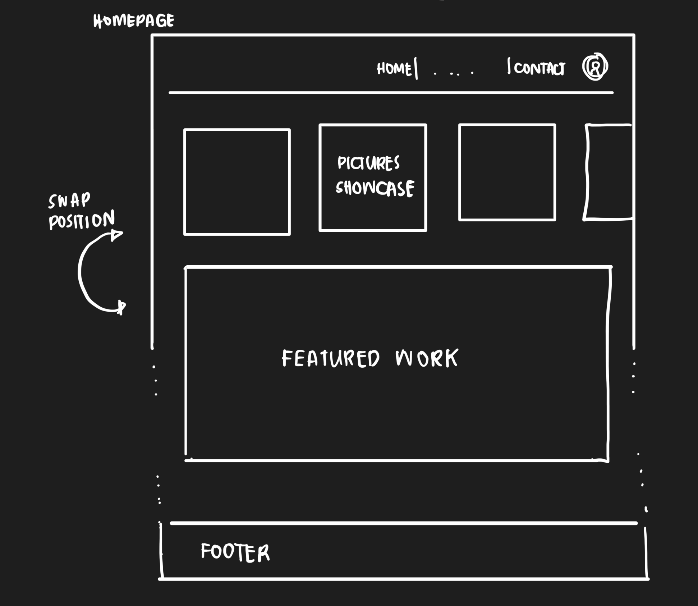
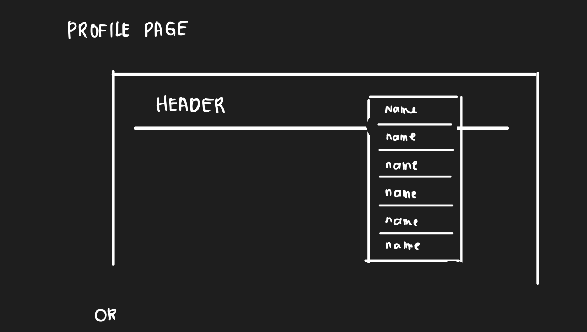
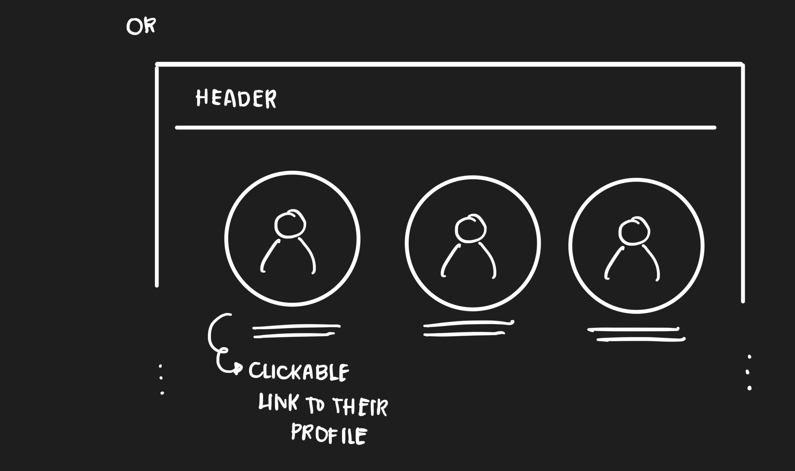
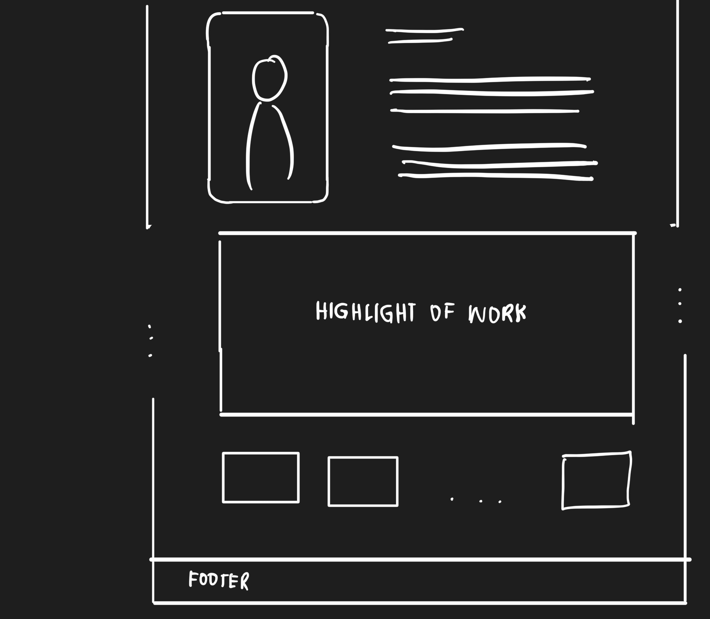
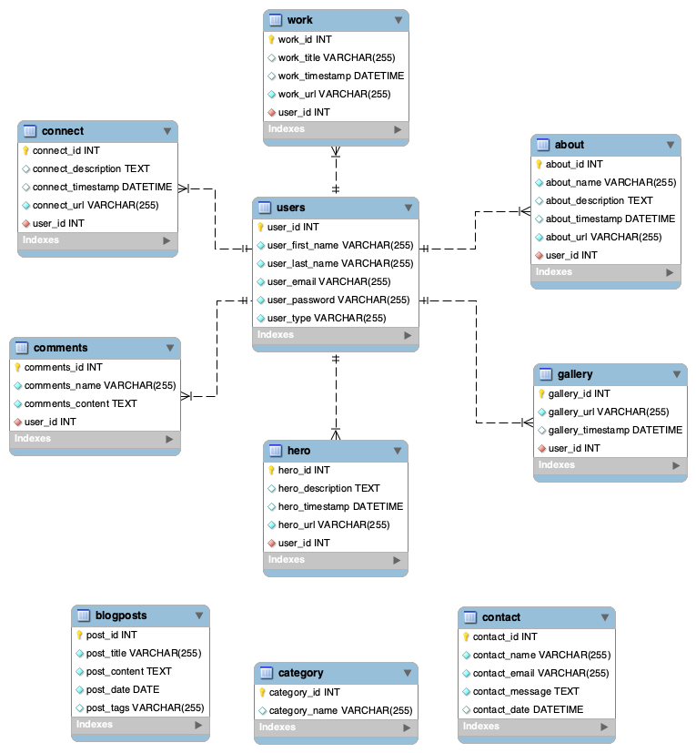

# Project Title
PhotoNest
Photographer Portfolio Showcase Website

## Overview
The website allows a photographer to create a profile and showcase their work through portfolios. It serves as a platform for a photographer to display their skills and for potential clients to browse and connect with them.

### Problem
Photographers need a user-friendly and visually appealing platform to showcase their work online. Existing platforms often lack the simplicity or are too complex for users to navigate and maintain. This can make it difficult for photographers to effectively present their portfolios and attract potential clients. The challenge is to develop a website that combines ease of use and aesthetic appeal to meet the needs of photographers.

### User Profile
2 Types of Users:
* Photographer: Users of the website will primarily be a photographer looking to showcase their work. 
    * One portfolio page per photographer, that is accessible through their a link from either the navigation bar or their names in the photographer's page. 
    * Showcase their work through the platform by uploading images.
    * The app must provide an intuitive interface for a photographer to upload and organize their photos.
    * Communicate with potential clients through the contact form.
    * Engage in social interactions through comments and likes.

* Client: Potential clients seeking to hire a photographer.
    * Browse through different portfolios
    * A seamless browsing experience for visitors.
    * Possibly engage in social interactions through comments and likes
    * Communicate with the photographers through a contact form

### Features
* Register and Login: 
    - Pages for user authentication.
* Photographer Profile(Dashboard): 
    - Photographer can create and manage personal profile.
* Portfolio Creation: 
    - Photographer can upload and organize their photos into portfolios. 
    - Only users registered as "photographers" can create and edit portfolios. 
    - Users who are registered as "clients" will be redirected to the not found page when they click on the edit portfolio navigation. 
* Portfolio Viewing: 
    - Visitors can browse portfolios by photographer. 
    - Only registered users can browse portfolio of registered photographers. 
    - Guests who did not register could only view the landing page and the contact page. 
* Contact Form: 
    - Potential clients can contact a photographer directly through a form.
* Responsive Design: 
    - The website will be fully responsive to ensure a good user experience on all devices.

## Implementation

### Tech Stack
Frontend
HTML
CSS
JavaScript
React.js

Backend
Node.js
Express.js

Database
MySQL with Knex.js for query building

Client Libraries
react
react-router-dom
react-modal
axios
sass
mui/icons-material
mui/material

Server libraries
express

External Libraries (Store and serve user-generated content like images)
Cloudinary

Limitations:
Cloudinary: Limitations in terms of storage space, API call limits, or bandwidth.

### APIs
Cloudinary API: For image upload and management

### Sitemap
1. Home Page: Overview of the website
2. Photographer Page: List of registered photographers within the app.
3. Portfolio Section: Display of portfolios and individual photo galleries.
4. Contact Form: Form for visitors to contact a photographer.

### Mockups
HOME PAGE

CONTACT PAGE

PROFILE PAGE

PORTFOLIO SECTION

### Data

### Endpoints
* GET /api/portfolio/:id: Retrieve a specific portfolio.

* POST /api/upload: Upload an image.

* GET/api/hero:
* GET /api/herp/:user_id:
* POST /api/herp/upload:

* GET /api/work:
* GET /api/work/:user_id:
* POST /api/work/upload:

* GET /api/about/:
* GET /api/about/:user_id:
* POST /api/about/upload:

* GET /api/connect:
* GET /api/connect/:user_id:
* POST /api/connect/upload:

* GET /api/gallery:
* GET /api/gallery/:user_id:
* POST /api/gallery/upload:

* POST /api/contact: Send a message to a photographer.

### Auth
* POST /api/auth/register: User registration.
* POST /api/auth/login: User login.
* GET /api/auth/profile: Retrieve user token.
* GET /api/auth/logout: User logout.