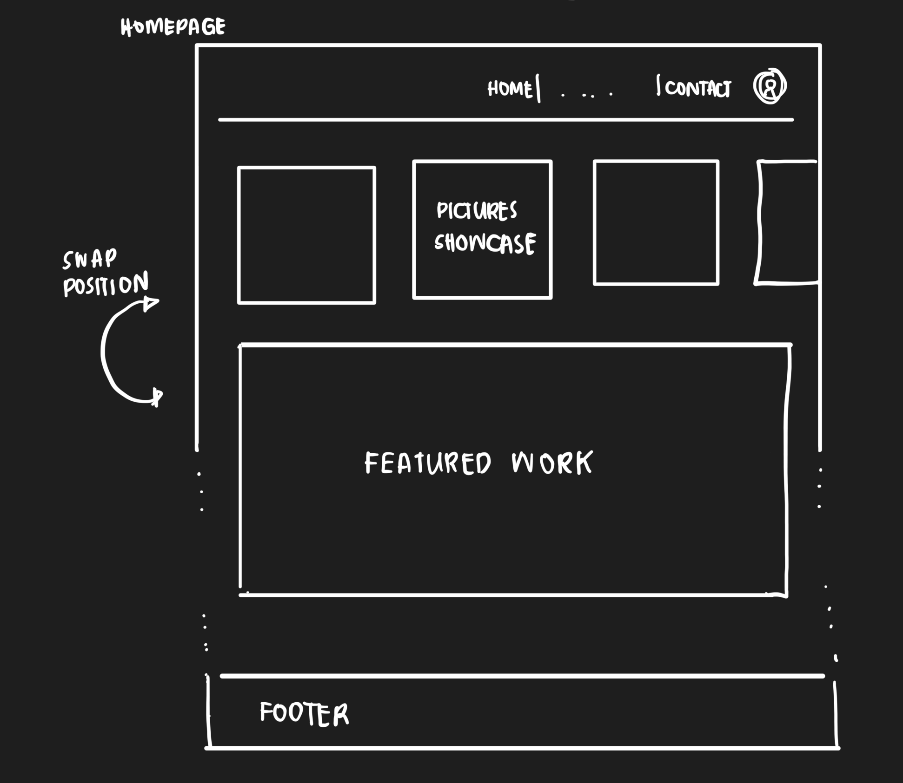
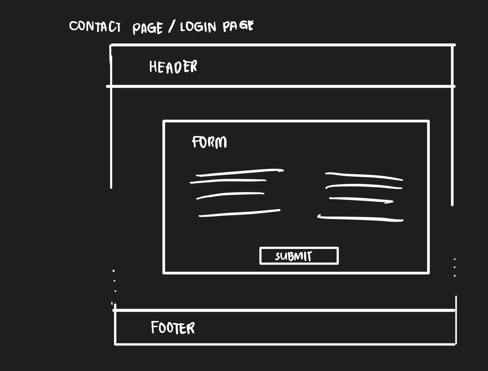

# Project Title
PIXELHIVE
Photographer Portfolio Showcase Website

## Overview

The website allows a photographer to create a profile and showcase their work through portfolios. It serves as a platform for a photographer to display their skills and for potential clients to browse and connect with them.

### Problem

Photographers need an easy and visually appealing way to showcase their work online. Existing platforms may not offer enough customization or might be too complex for users to navigate and maintain.

### User Profile

2 Types of Users:
* Photographer: Users of the website will primarily be a photographer looking to showcase their work. 
* Clients: Potential clients seeking to hire a photographer.

* The app must provide an intuitive interface for a photographer to upload and organize their photos, and a seamless browsing experience for visitors.

### Features
<!-- List the functionality that your app will include. These can be written as user stories or descriptions with related details. Do not describe _how_ these features are implemented, only _what_ needs to be implemented. -->

* Photographer Profile: Photographer can create and manage personal profile.
* Portfolio Creation: Photographer can upload and organize their photos into portfolios.
* Portfolio Viewing: Visitors can browse portfolios by category, style, or photographer.
* Contact Form: Potential clients can contact a photographer directly through a form.
* Responsive Design: The website will be fully responsive to ensure a good user experience on all devices.

## Implementation

### Tech Stack
<!-- List technologies that will be used in your app, including any libraries to save time or provide more functionality. Be sure to research any potential limitations. -->

Frontend: HTML, CSS, JavaScript, React.js
Backend: Node.js, Express.js
Database: MySQL with Knex.js for query building
External Libraries: Cloudinary (for image storage and management)

Limitations:
Cloudinary: Depending on the free tier, you might face limitations in terms of storage space, API call limits, or bandwidth.

### APIs

Cloudinary API: For image upload and management or own image server.

### Sitemap
<!-- List the pages of your app with brief descriptions. You can show this visually, or write it out. -->

1. Home Page: Overview of the website and features a photographer.
2. Photographer Profile: Individual profile page for a photographer. This will be a gallery if there is more than one photographer and it will link to their individual profile.
3. Portfolio Section: Display of portfolios and individual photo galleries.
4. Contact Form: Form for visitors to contact a photographer.

### Mockups
<!-- Provide visuals of your app's screens. You can use tools like Figma or pictures of hand-drawn sketches. -->

### Data
<!-- Describe your data and the relationships between them. You can show this visually using diagrams, or write it out.  -->

* Users: Contains user profiles (photographers)
* Portfolios: Stores details of each portfolio, including title, description, and associated images.
* Images: Metadata for images uploaded by photographers.

### Endpoints
* POST /api/portfolios: Create a new portfolio.
* GET /api/portfolios: Retrieve portfolios.
* GET /api/portfolios/: Retrieve a specific portfolio.

* POST /api/images: Upload an image.
* GET /api/images/: Retrieve images for a specific portfolio.

* POST /api/contact: Send a message to a photographer.

### Auth

## Roadmap
<!-- Scope your project as a sprint. Break down the tasks that will need to be completed and map out timeframes for implementation. Think about what you can reasonably complete before the due date. The more detail you provide, the easier it will be to build. -->

Week 1: Planning and Backend Development
* Set up database schema and APIs for portfolio creation, and image management.
* Implement backend logic for handling image uploads using Cloudinary.
* Begin frontend development for photgrapher profile and portfolio creation.
* Begin frontend development for contact form

Week 2: Frontend Development and Integration

* Complete frontend development for portfolio creation and display.
* Integrate frontend with backend APIs.
* Test and refine portfolio creation and image upload functionality.
* Test and refine the contact form functionality.
* Ensure responsive design and test on multiple devices.

## Nice-to-haves
<!-- Your project will be marked based on what you committed to in the above document. Under nice-to-haves, you can list any additional features you may complete if you have extra time, or after finishing. -->

Features:
* Login/Register: Pages for user authentication.
* Search Functionality: Visitors can search for a photographer by name, location, or specialty.
* Advanced Search Filters: Allow visitors to filter a photographer by various criteria such as price range, location, and style.
* Comment and Like System: Users can leave comments and likes on photos or portfolios.
* Social Media Integration: Photographers can link their social media profiles.
* Booking System: Enable clients to book sessions with a photographer directly through the website.
* Blog Section: Allow a photographer to post articles or updates.

Sitemap:
* Search Results: Page to display search results based on user queries.
* Booking System: Page to where clients can book sessions with a photographer.
* Blog Section: Page where a photographer could create and posts blogs.

Data
* Comments and Likes: Stores user interactions with portfolios.

Endpoints: 
* POST /api/auth/register: User registration.
* POST /api/auth/login: User login.

* POST /api/comments: Add a comment to a portfolio.
* POST /api/likes: Like a portfolio or image.

AUTH
* POST /api/auth/register: User registration.
* POST /api/auth/login: User login.
* GET /api/auth/logout: User logout.

Roadmap:
* Set up database schema and APIs for user registration
* Implement user authentication and profile management.